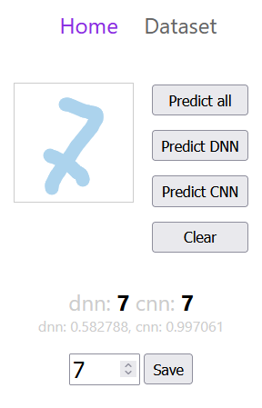

# Simple digits recognition with JavaScript

Small project to get familiar with deep neural networks(DNN) and Convolutional neural networks(CNN) basics using JavaScript.

Useing Node version of [TensorflowJs](https://www.tensorflow.org/js) to deal with neural networks and [Svelte](https://svelte.dev/) for the front-end.

Client side with on SvelteKit – https://github.com/webdim0/dnn_basic_imgrec/tree/main/client-sk

Server side – https://github.com/webdim0/dnn_basic_imgrec/tree/main/server

Client side with DNN only on Svelte and Vite – https://github.com/webdim0/dnn_basic_imgrec/tree/main/client

