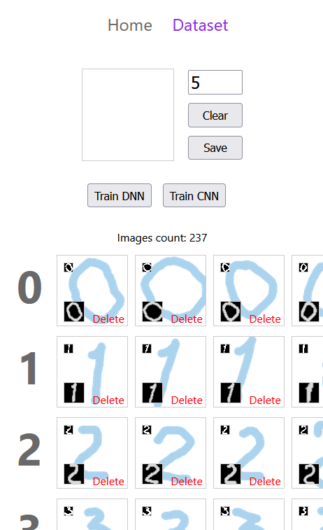

# Simple digits recognition with JavaScript

Small project to get familiar with deep neural networks(DNN) basics using JavaScript.

Useing Node version of [TensorflowJs](https://www.tensorflow.org/js) to deal with DNN and [Svelte](https://svelte.dev/) and [Vite](https://vitejs.dev/) for the front-end.

Client side – https://github.com/webdim0/dnn_basic_imgrec/tree/main/client

Server side – https://github.com/webdim0/dnn_basic_imgrec/tree/main/server

